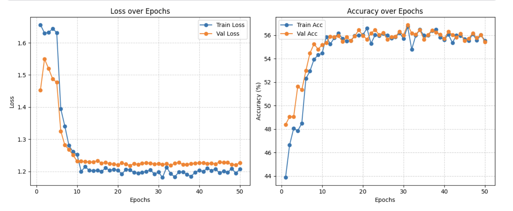
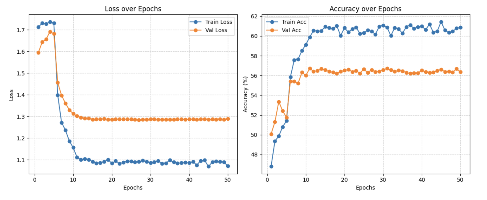

# Benchmarking-Modern-CNN-Architectures-for-Multi-Dataset-Facial-Expression-Recognition
This repository implements a unified facial emotion recognition pipeline trained and evaluated across RAF-DB, FER2013, and AffectNet.

The project systematically compares ResNet-50, EfficientNet-B0, and MobileNet-V3 under three training setups:

- Setup 1 — Frozen backbone, train classifier head

- Setup 2 — Full fine-tuning on FER2013

- Setup 3 — Full fine-tuning on AffectNet (YOLO label format)

# Training results

## It includes:

- Preprocessing for 3 datasets
- Transfer learning using multiple architectures
- Advanced training (Cosine LR + Warmup, early stopping, class weights)
- Robust evaluation (macro-F1, macro-AUC, ECE, PR/ROC curves)
- Temperature scaling for calibration
- Per-image prediction CSVs for further analysis

# Key Features

## Model Architectures

- ResNet-50
- EfficientNet-B0
- MobileNet-V3 Large/Small

## Datasets

- RAF-DB (clean professional dataset)
- FER2013 (simple grayscale dataset)
- AffectNet YOLO format (largest FER dataset)

## Training Improvements

- Linear warmup
- Cosine learning rate decay
- Weighted cross-entropy
- Early stopping

## Evaluation Metrics

- Accuracy / Precision / Recall / F1 (micro & macro)
- Macro-AUC (OVR)
- Per-class PR & ROC curves
- Confusion matrices
- Expected Calibration Error (ECE)
- Temperature scaling
